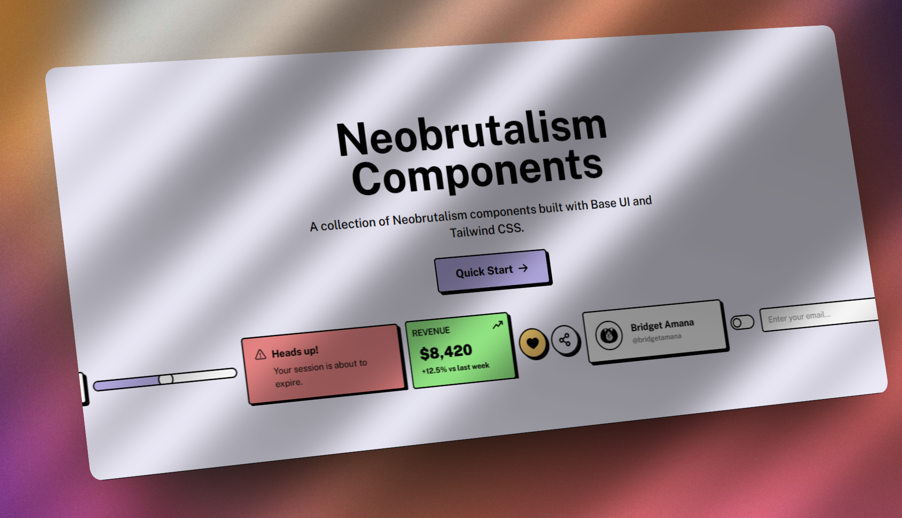

<div align="center">
  

  <h1>Neobrutal UI</h1>

  <p>A refined, open-source collection of Neobrutalism-styled components built with Base UI and Tailwind CSS.</p>

  <p>
    <a href="https://www.npmjs.com/package/neobrutal"></a>
    <a href="https://github.com/Bridgetamana/neobrutal-ui/blob/main/license.md"></a>
    <a href="https://github.com/Bridgetamana/neobrutal-ui/graphs/contributors"></a>
  </p>
</div>

<br />

## Why Neobrutal UI?

Neobrutalism UI is characterized by bold typography, high-contrast colors, harsh borders, and solid shadows. Our goal is to provide a complete suite of raw, accessible, and easily customizable React components that just work. 

✨ **Features**
- **Copy-Paste Architecture**: Like `shadcn/ui`, you own the code. No hidden NPM packages that break your layout.
- **Accessible First**: Built on top of `Base UI` guaranteeing full keyboard and screen reader support.
- **Dark/Light Flexibility**: Effortlessly custom themes via straightforward CSS variables.
- **TypeScript Ready**: Written in 100% strict TypeScript.

## Quick Start

The fastest way to get started is by using the our CLI!

```bash
# Initialize Neobrutal UI in your Next.js/React project
npx neobrutal init

# Add components directly
npx neobrutal add button card dialog
```

Or just copy the source code directly from our [Documentation](https://www.neobrutalui.live) site.

## Available Components

Currently, we support the following out-of-the-box components:

<details>
<summary><b>View Component List</b></summary>
<br>

- Accordion
- Alert
- Avatar
- Badge
- Button
- Card
- Checkbox
- Dialog
- Input
- Label
- Pagination
- Popover
- Progress
- Radio Group
- Select
- Slider
- Switch
- Tabs
- Textarea
- Toast
- Tooltip

*More coming soon...*
</details>

## Community & Contributing

We absolutely love community contributions! Help us make Neobrutal UI the defacto library for Neobrutalism style.
- Read our [Contributing Guide](CONTRIBUTING.md) to get started on creating a PR.
- Please adhere to our [Code of Conduct](CODE_OF_CONDUCT.md).

## Supporters

[](https://vercel.com/oss)

## License

This project is licensed under the terms of the [MIT License](license.md).

---

<div align="center">
  Built with ❤️, <b>React</b>, <b>Tailwind CSS</b>, and <b>Base UI</b>.
</div>
